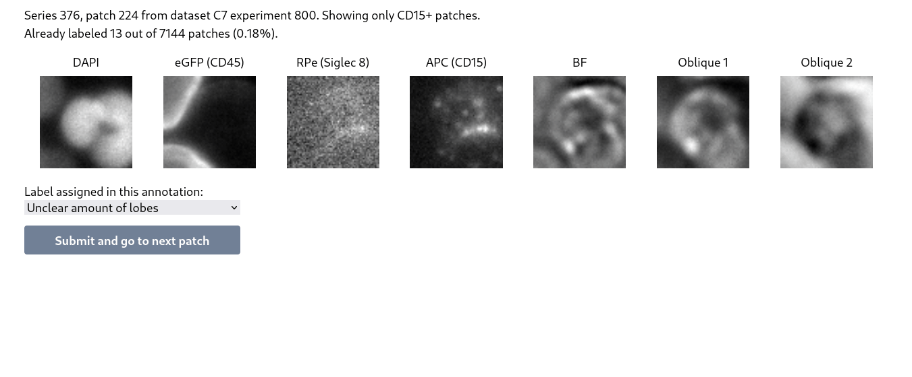

# Single-cell annotator



Single-cell anntator is a web app for manually annotating images of single-cells. It presents
the user with a number of randomly selected unlabaled cells in an easy-to-use interface.

The app is built using Django and TailwindCSS.

## Features
* Read images directly from Carl Zeiss Image (CZI) files
* Support for multiple annotations per cell
* Easy to configure thanks to Django administration
* Export annotations to CSV

# Installation

# Usage

Import segmentations from Pandas dataframe:
```
python manage.py import_segmentations {dataset_id} {segmentations_file} [--limit {limit}]
```
Replace:
* `{dataset_id}` with the primary key of the dataset you created in the Django administator
* `{segmentations_file}` with a parquet-file containing a Pandas dataframe with columns:
  * meta_scene: scene id from CZI-file
  * meta_tile: tile id from CZI-file
  * meta_bbox_minr, meta_bbox_maxr, meta_bbox_minc, meta_bbox_maxc: bounding box coordinates
* `{limit}` with optional limit on the amount of rows to import

Export annotations to CSV using the following commands:
```
python manage.py {dataset_id} --path output.csv
```
Replace `{dataset_id}` with the dataset's primary key.